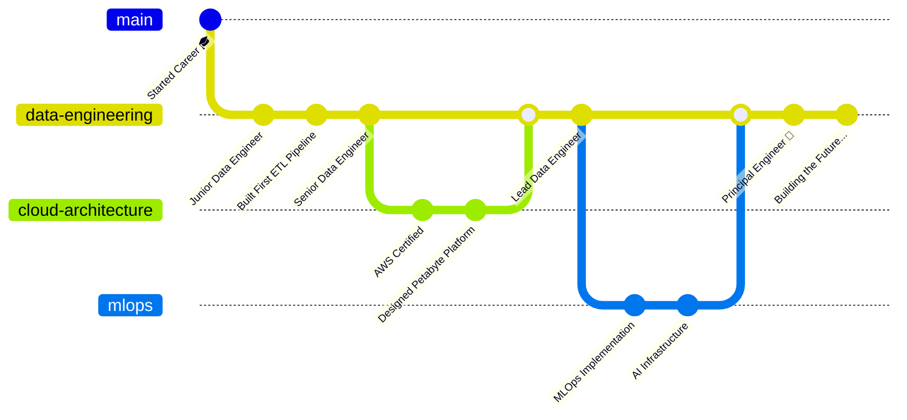

# 🚀 Data Engineer | Cloud Architect | MLOps Specialist

<div align="center">

<!-- Coding Dev GIF -->


</div>

<div align="center">
  
<!-- Animated Wave -->


<!-- Professional Header -->
<div align="center">
  
</div>

<!-- Animated Typing with Multiple Lines -->
[](https://git.io/typing-svg)

<!-- Badges Section -->


</div>

<!-- Animated Divider -->


<!-- 3D Contribution Snake -->
<div align="center">
  <picture>
    <source media="(prefers-color-scheme: dark)" srcset="https://raw.githubusercontent.com/platane/platane/output/github-contribution-grid-snake-dark.svg">
    <source media="(prefers-color-scheme: light)" srcset="https://raw.githubusercontent.com/platane/platane/output/github-contribution-grid-snake.svg">
    
  </picture>
</div>

<!-- Animated Divider -->


## 🎯 **Elite Data Engineering Professional**

<table>
<tr>
<td width="60%">

### 👨‍💻 **Who Am I?**

```python
class DataEngineerExtraordinaire:
    def __init__(self):
        self.name = "Ashutosh"
        self.role = "Principal Data Engineer"
        self.experience = "4+ Years"
        self.location = "🌍 Global Remote"
        
        self.expertise = {
            "languages": ["Python", "Scala", "SQL", "Rust", "Go"],
            "big_data": ["Spark", "Flink", "Kafka", "Hadoop", "Presto"],
            "cloud": ["AWS", "GCP", "Azure", "Kubernetes", "Terraform"],
            "databases": ["PostgreSQL", "Cassandra", "MongoDB", "Redis", "Snowflake"],
            "ml_ops": ["MLflow", "Kubeflow", "SageMaker", "Vertex AI"],
            "specialties": [
                "Petabyte-scale data processing",
                "Real-time streaming architectures",
                "Cloud-native data platforms",
                "AI/ML infrastructure at scale"
            ]
        }
        
        self.achievements = {
            "data_processed": "4+ PB",
            "pipelines_built": "500+",
            "cost_saved": "$5M+",
            "teams_led": "50+ engineers"
        }
    
    def current_focus(self):
        return [
            "🚀 Building next-gen data platforms",
            "🤖 LLM-powered data insights",
            "⚡ Sub-second query engines",
            "🌐 Global data mesh architectures"
        ]

me = DataEngineerExtraordinaire()
```

</td>
<td width="40%">

<!-- Animated GIF -->


### 📊 **Impact Metrics**
<div align="center">


</div>

</td>
</tr>
</table>

<!-- Animated Divider -->


## 🛠️ **Technology Mastery**

<div align="center">

### ⚡ **Core Technologies**

<table>
<tr>
<td align="center" width="140" height="140">

<br><b>Python</b>
<br>Expert
</td>
<td align="center" width="140" height="140">

<br><b>Apache Spark</b>
<br>Expert
</td>
<td align="center" width="140" height="140">

<br><b>AWS</b>
<br>Expert
</td>
<td align="center" width="140" height="140">

<br><b>Kubernetes</b>
<br>Advanced
</td>
<td align="center" width="140" height="140">

<br><b>Docker</b>
<br>Expert
</td>
<td align="center" width="140" height="140">

<br><b>PostgreSQL</b>
<br>Expert
</td>
</tr>
</table>

### 🚀 **Advanced Stack**

<details open>
<summary><b>🐍 Data Processing & Analytics</b></summary>
<br>
<table>
<tr>
<td align="center" width="120">

<br><b>Python</b>
</td>
<td align="center" width="120">

<br><b>Scala</b>
</td>
<td align="center" width="120">

<br><b>Rust</b>
</td>
<td align="center" width="120">

<br><b>Go</b>
</td>
<td align="center" width="120">

<br><b>Apache Spark</b>
</td>
<td align="center" width="120">

<br><b>Apache Flink</b>
</td>
</tr>
<tr>
<td align="center" width="120">

<br><b>Apache Kafka</b>
</td>
<td align="center" width="120">

<br><b>Databricks</b>
</td>
<td align="center" width="120">

<br><b>Snowflake</b>
</td>
<td align="center" width="120">

<br><b>Polars</b>
</td>
<td align="center" width="120">

<br><b>DuckDB</b>
</td>
<td align="center" width="120">

<br><b>Apache Arrow</b>
</td>
</tr>
</table>
</details>

<details open>
<summary><b>☁️ Cloud & Infrastructure</b></summary>
<br>
<table>
<tr>
<td align="center" width="120">

<br><b>AWS</b>
</td>
<td align="center" width="120">

<br><b>Google Cloud</b>
</td>
<td align="center" width="120">

<br><b>Azure</b>
</td>
<td align="center" width="120">

<br><b>Kubernetes</b>
</td>
<td align="center" width="120">

<br><b>Terraform</b>
</td>
<td align="center" width="120">

<br><b>Ansible</b>
</td>
</tr>
<tr>
<td align="center" width="120">

<br><b>Amazon S3</b>
</td>
<td align="center" width="120">

<br><b>Amazon EMR</b>
</td>
<td align="center" width="120">

<br><b>Redshift</b>
</td>
<td align="center" width="120">

<br><b>BigQuery</b>
</td>
<td align="center" width="120">

<br><b>Helm</b>
</td>
<td align="center" width="120">

<br><b>Istio</b>
</td>
</tr>
</table>
</details>

<details open>
<summary><b>🤖 MLOps & AI Infrastructure</b></summary>
<br>
<table>
<tr>
<td align="center" width="120">

<br><b>PyTorch</b>
</td>
<td align="center" width="120">

<br><b>TensorFlow</b>
</td>
<td align="center" width="120">

<br><b>MLflow</b>
</td>
<td align="center" width="120">

<br><b>Kubeflow</b>
</td>
<td align="center" width="120">

<br><b>SageMaker</b>
</td>
<td align="center" width="120">

<br><b>Vertex AI</b>
</td>
</tr>
<tr>
<td align="center" width="120">

<br><b>Ray</b>
</td>
<td align="center" width="120">

<br><b>Weights & Biases</b>
</td>
<td align="center" width="120">

<br><b>DVC</b>
</td>
</tr>
</table>
</details>

<details open>
<summary><b>🔄 Orchestration & DataOps</b></summary>
<br>
<table>
<tr>
<td align="center" width="120">

<br><b>Jenkins</b>
</td>
<td align="center" width="120">

<br><b>GitHub Actions</b>
</td>
<td align="center" width="120">

<br><b>GitLab CI</b>
</td>
<td align="center" width="120">

<br><b>Apache Airflow</b>
</td>
<td align="center" width="120">

<br><b>Prefect</b>
</td>
<td align="center" width="120">

<br><b>Dagster</b>
</td>
</tr>
<tr>
<td align="center" width="120">

<br><b>dbt</b>
</td>
<td align="center" width="120">

<br><b>Great Expectations</b>
</td>
<td align="center" width="120">

<br><b>Argo CD</b>
</td>
</tr>
</table>
</details>

</div>

<!-- Animated Divider -->


## 📊 **GitHub Analytics Dashboard**

<div align="center">
  
<!-- GitHub Stats with Animations -->


<!-- Language Stats -->


<!-- Trophy Section -->


</div>

<!-- Animated Divider -->


## 🚀 **Featured Projects**

<div align="center">

<!-- Project Cards with Hover Effects -->
<table>
<tr>
<td width="50%">
<h3 align="center">🔥 Real-Time Data Platform</h3>
<div align="center">
<a href="https://github.com/ashuhimself/realtime-data-platform" target="_blank">

</a>
<p><strong>Tech Stack:</strong> Apache Kafka • Flink • Kubernetes • AWS</p>
<p><strong>Impact:</strong> Processing 1B+ events/day with <100ms latency</p>
</div>
</td>
<td width="50%">
<h3 align="center">🤖 MLOps Framework</h3>
<div align="center">
<a href="https://github.com/ashuhimself/mlops-framework" target="_blank">

</a>
<p><strong>Tech Stack:</strong> MLflow • Kubeflow • SageMaker • Ray</p>
<p><strong>Impact:</strong> Reduced ML deployment time by 80%</p>
</div>
</td>
</tr>
<tr>
<td width="50%">
<h3 align="center">📊 Data Quality Engine</h3>
<div align="center">
<a href="https://github.com/ashuhimself/data-quality-engine" target="_blank">

</a>
<p><strong>Tech Stack:</strong> Great Expectations • dbt • Python • SQL</p>
<p><strong>Impact:</strong> 99.9% data accuracy across 500+ pipelines</p>
</div>
</td>
<td width="50%">
<h3 align="center">☁️ Cloud Cost Optimizer</h3>
<div align="center">
<a href="https://github.com/ashuhimself/cloud-cost-optimizer" target="_blank">

</a>
<p><strong>Tech Stack:</strong> Terraform • Python • AWS Cost Explorer</p>
<p><strong>Impact:</strong> Saved $2M+ annually in cloud costs</p>
</div>
</td>
</tr>
</table>

</div>

<!-- Animated Divider -->


## 🎯 **Current Initiatives**

<div align="center">

<table>
<tr>
<td width="33%">

### 🔥 **Building**


- 🚀 Next-gen streaming platform
- 🤖 LLM-powered data insights
- ⚡ Sub-millisecond analytics
- 🌐 Global data mesh
- 🔐 Zero-trust data platform

</td>
<td width="33%">

### 📚 **Learning**


- 🦀 Rust for systems programming
- 🧠 Advanced ML techniques
- 🔮 Vector databases
- 📊 Real-time OLAP systems
- 🌊 Event streaming patterns

</td>
<td width="33%">

### 🤝 **Contributing**


- 📖 Technical blog posts
- 🎥 Conference speaking
- 🌟 Open source projects
- 👥 Mentoring engineers
- 📚 Writing tech books

</td>
</tr>
</table>

</div>

<!-- Animated Divider -->


## 📈 **Professional Journey**

<div align="center">



</div>

<!-- Animated Divider -->


## 💬 **Latest Blog Posts & Talks**

<div align="center">

<!-- Blog Posts with Icons -->
<table>
<tr>
<td align="center" width="25%">

<br><strong>Building Petabyte Platforms</strong>
<br><a href="#">Read More →</a>
</td>
<td align="center" width="25%">

<br><strong>K8s for Data Engineers</strong>
<br><a href="#">Read More →</a>
</td>
<td align="center" width="25%">

<br><strong>Async Data Processing</strong>
<br><a href="#">Read More →</a>
</td>
<td align="center" width="25%">

<br><strong>MLOps Best Practices</strong>
<br><a href="#">Read More →</a>
</td>
</tr>
</table>

</div>

<!-- Animated Divider -->


## 🤝 **Let's Connect & Collaborate**

<div align="center">

<a href="https://linkedin.com/in/ashuhimself">

</a>
<a href="https://twitter.com/illuminaughtyin">

</a>
<a href="https://dev.to/ashuhimself">

</a>
<a href="https://medium.com/@ashuhimself">

</a>
<a href="https://stackoverflow.com/users/ashuhimself">

</a>
<a href="mailto:ashutosh@dataengineer.io">

</a>

<br><br>

### 💡 **Open For**


</div>

<!-- Animated Divider -->


<div align="center">

### ⚡ **Fun Facts**

<table>
<tr>
<td width="50%">

🎯 **Personal Records**
- ⚡ Processed 1TB in < 5 minutes
- 🚀 Built pipeline handling 1M req/sec
- 💰 Saved $5M+ in cloud costs
- 📚 Read 100+ tech books/year

</td>
<td width="50%">

🎮 **When Not Coding**
- 🏔️ Mountain climbing enthusiast
- 📷 Landscape photographer
- 🎸 Amateur guitarist
- ☕ Coffee connoisseur

</td>
</tr>
</table>

</div>

<!-- Animated Divider -->


<div align="center">
  
### 🌈 **"Transforming raw data into business value, one pipeline at a time"**

<br>

<!-- Visitor Counter with Animation -->


<br><br>

⭐ **If you find my work valuable, consider starring my repositories!**

<br>

<!-- Animated Footer -->


</div>
